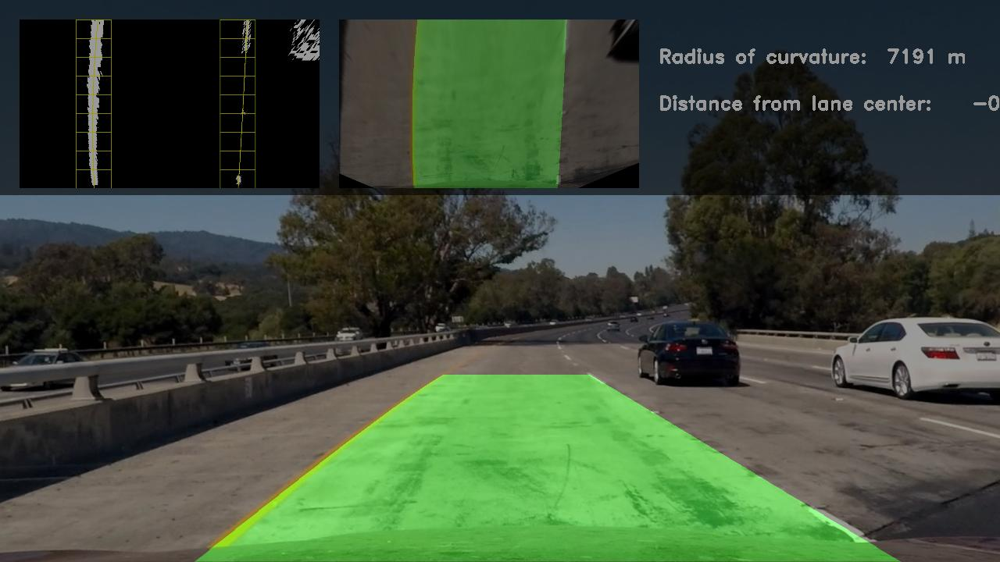

## Advanced Lane Finding

This project presents a software pipeline capable of accurately detecting lane lines for a self-driving car using computer vision techniques such as camera calibration, perspective warping, and edge detection. 

The steps taken to achieve the final result are as follows: 
1.	Calibrate the camera to obtain the camera matrix and distortion coefficients. 
2.	Undistort images before processing begins. 
3.	Initialize two lane line objects to store lane data across the video processing.
4.	Develop a mask of the image where edges were detected using thresholds on sobel gradients and color transforms which are stacked together. 
5.	Create a histogram of the image to find pixel across the image.
6.	Use sliding window objects to detect left and right lane lines. 
7.	Grab the detected pixel indices and use it to fit a line, calculate radius curvature data and distance from center of lane.
8.	Feed information into the lane overlay functions and display results. 

The images for camera calibration are stored in the folder called `camera_cal`.  The images in `test_images` are for testing the pipeline on single frames.  

Final result:

